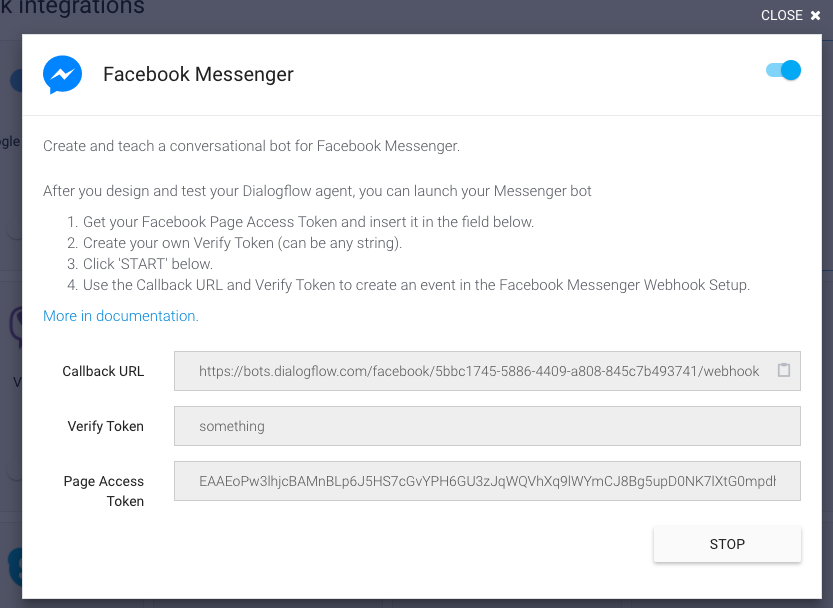
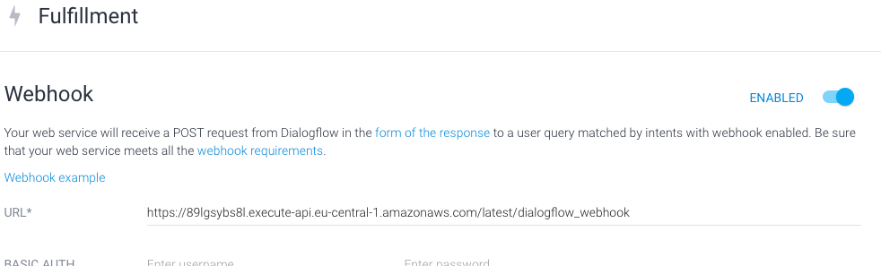

# Dialogflow Agent

## Configuration

The Facebook Messenger integration in Dialogflow must have set the `Page Access Token` generated by a Facebook App for a specific Facebook Page. The field `Verify Token` must be set to start the bot. However, we do not use this value, so anything will work. 
*If we would use Dialogflow directly as a webhook for Facebook we would need that value.*

In the fulfillment settings you must set the URL of the API Gateway Resource to the dialogflow_webhook.

