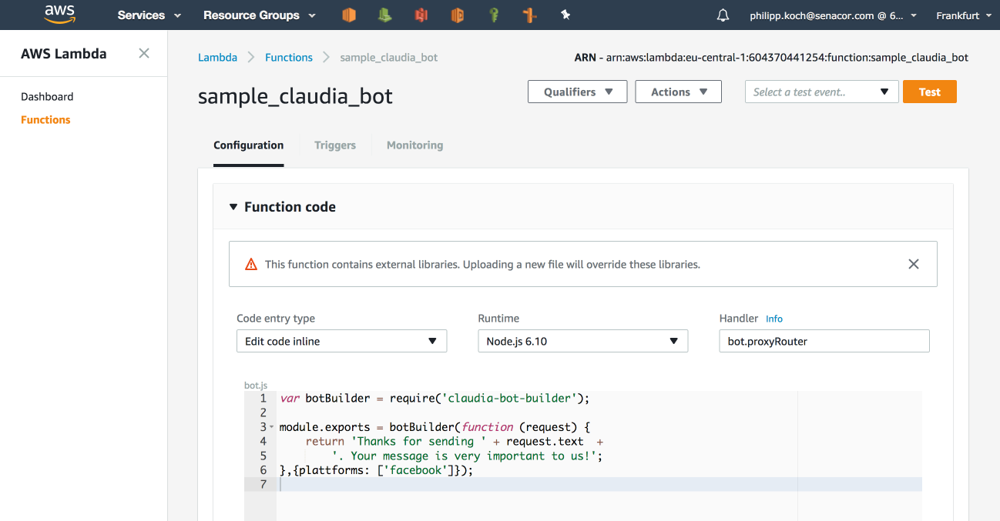
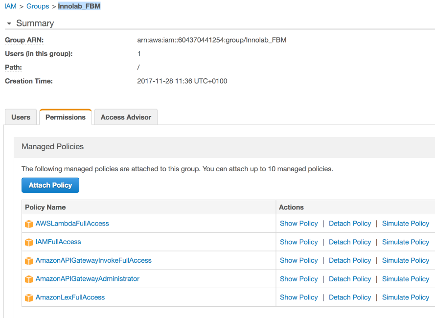

# AWS Infrastructure

## Overview

In our innovation lab we use a function as a service approach to operate the Facebook messenger bot.
With approach the functionality of the bot will be deployed without any obvious infrastructure. Only the function code will be deployed and is ready to used.
Therefore we benefits with a very high scalability and low costs.

We chose AWS in our innovation lab to provide this infrastructure. For that we use the following components:

* AWS Lambda: With AWS Lambda we provide the business logic of the messanger bot.
* AWS IAM: With the AWS Identity and Access Management (IAM) we have to define the correct roles and policies to create and run the bot.
* AWS API Gateway: The AWS API Gateway will be used to provide a REST service which calles the lambda function of the bot.

The following picture give an overview over the used AWS components:


## AWS Lambda


The actual business logic of the bot will be places as lambda function. The lambda function can be written in different programming languages:

* Node.js
* Python
* C#
* Java

We use Node.JS for our bot. To eliminate the boiler blade code for communicating with facebook, we use a facebook bot lib from claudia.

To be allowed to create and run the lambda function you have to fulfill the following rules:

* The use which has to administrate the infrastructure need the rights to create, change and delete them
* The single components need the rights to access necessary AWS components.

## AWS IAM

### Benutzer Berechtigungen



To give a user or a group of users the rights to administrator our infrastructure we had created the following groupe in AWS: Innolab_FBM

In this group you need the follwing policies:

* AWSLambdaFullAccess
* IAMFullAccess
* AmazonAPIGatewayInvokeFullAccess
* AmazonAPIGatewayAdministrator
* AmazonLexFullAccess

Add all users to this group which should be able to administer the infrastructure.

### Lambda Rolle und Berechtigungen


To make an lambda executable, the lambda need a role with the following inline policies:
```json
{
    "Version": "2012-10-17",
    "Statement": [
        {
            "Effect": "Allow",
            "Action": [
                "logs:CreateLogGroup",
                "logs:CreateLogStream",
                "logs:PutLogEvents"
            ],
            "Resource": "arn:aws:logs:*:*:*"
        }
    ]
}
```

