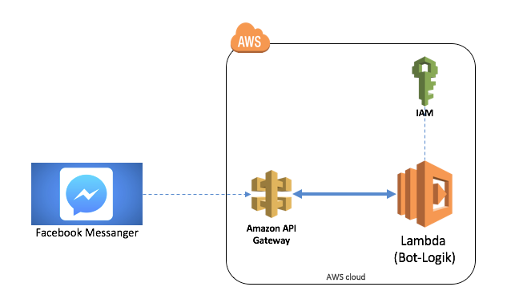

# AWS Infrastructure

## Overview

In our innovation lab we use a function as a service approach to operate the Facebook messenger bot.
With approach the functionality of the bot will be deployed without any obvious infrastructure. Only the function code will be deployed and is ready to used.
Therefore we benefits with a very high scalability and low costs.

We chose AWS in our innovation lab to provide this infrastructure. For that we use the following components:

* AWS Lambda: With AWS Lambda we provide the business logic of the messanger bot.
* AWS IAM: With the AWS Identity and Access Management (IAM) we have to define the correct roles and policies to create and run the bot.
* AWS API Gateway: The AWS API Gateway will be used to provide a REST service which calles the lambda function of the bot.

The following picture give an overview over the used AWS components:

## Infrastructure setup

To not manually setup all the AWS components or withe IaC scrips by ourselves, we use the tooling [claudia.js](https://github.com/claudiajs/claudia).

This tooling makes it very easy to setup node.js based lambda function which will be provided via AWS API Gateway.

## Components

- [AWS IAM](./aws_iam.md)
- [AWS API Gateway](./aws_api_gateway.md)
- [AWS Lambda](./aws_lambda.md)
- [AWS DynamoDB](./aws_dynamodb.md)