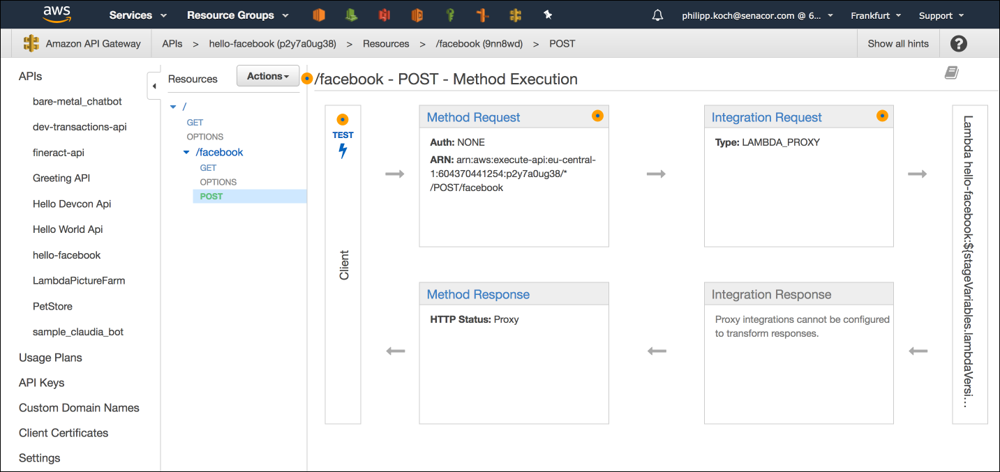
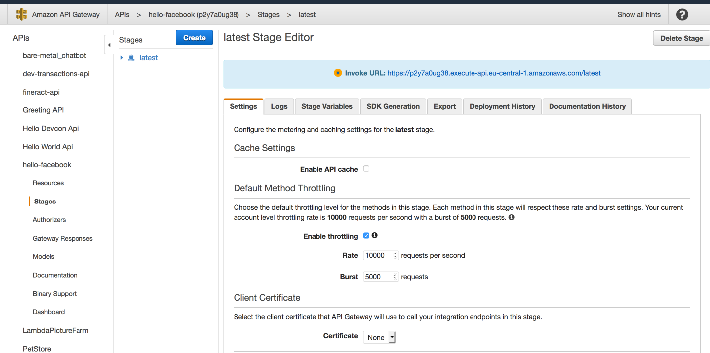

# AWS API Gateway

Facebook needs to have a REST-URL as webhook to send incoming messages to, so we have to make the lambda function available via https. Therefore, we use the AWS API Gateway.

With the API Gateway we can define REST endpoints with the methods and define what action should be performed when the endpoint
and method is called. In this case the lambda function should be called.

In the API gateway multiple version or stages of you configuration can be added. Although some stage variables can be stored there to prevent storing them inside the code.

