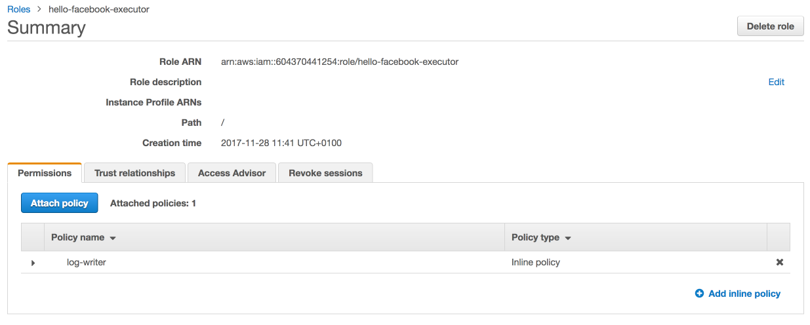

# AWS IAM

## Benutzer Berechtigungen


To give a user or a group of users the rights to administrator our infrastructure we had created the following groupe in AWS: Innolab_FBM

In this group you need the follwing policies:

* AWSLambdaFullAccess
* IAMFullAccess
* AmazonAPIGatewayInvokeFullAccess
* AmazonAPIGatewayAdministrator
* AmazonLexFullAccess

Add all users to this group which should be able to administer the infrastructure.

## Lambda Rolle und Berechtigungen



To make an lambda executable, the lambda need a role with the following inline policies:
```json
{
    "Version": "2012-10-17",
    "Statement": [
        {
            "Effect": "Allow",
            "Action": [
                "logs:CreateLogGroup",
                "logs:CreateLogStream",
                "logs:PutLogEvents"
            ],
            "Resource": "arn:aws:logs:*:*:*"
        }
    ]
}
```