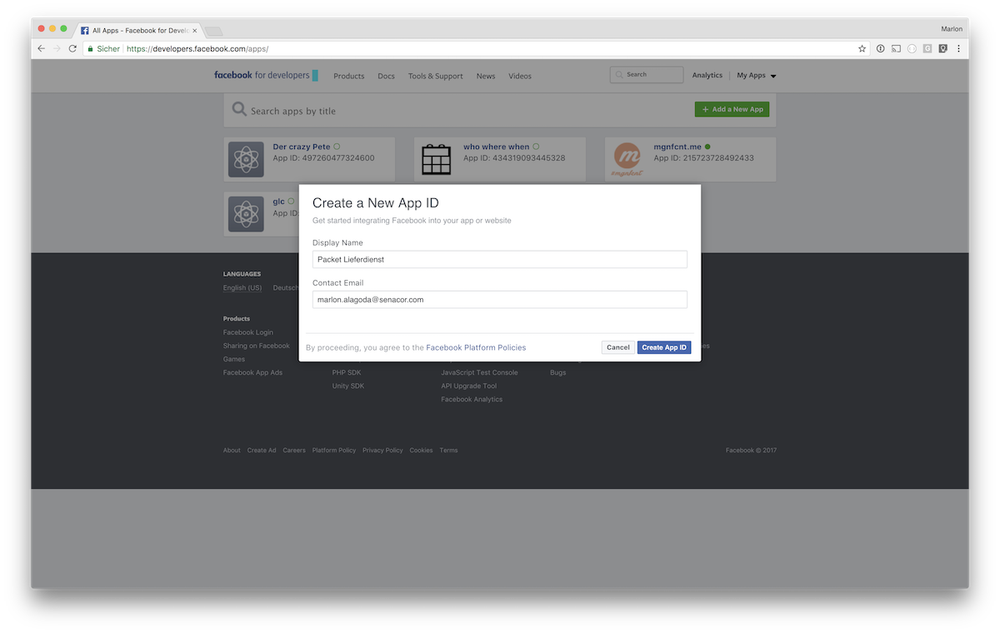
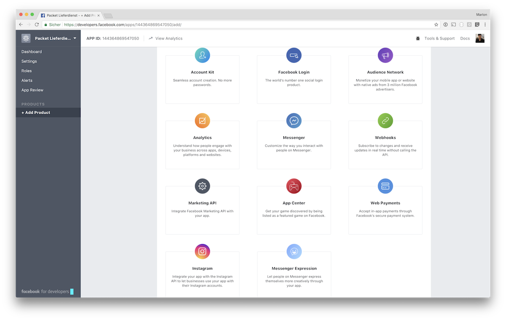
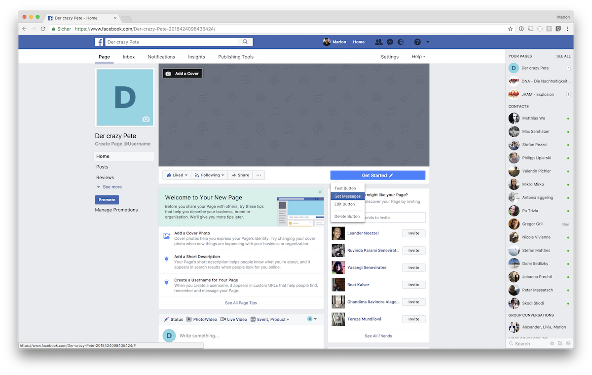
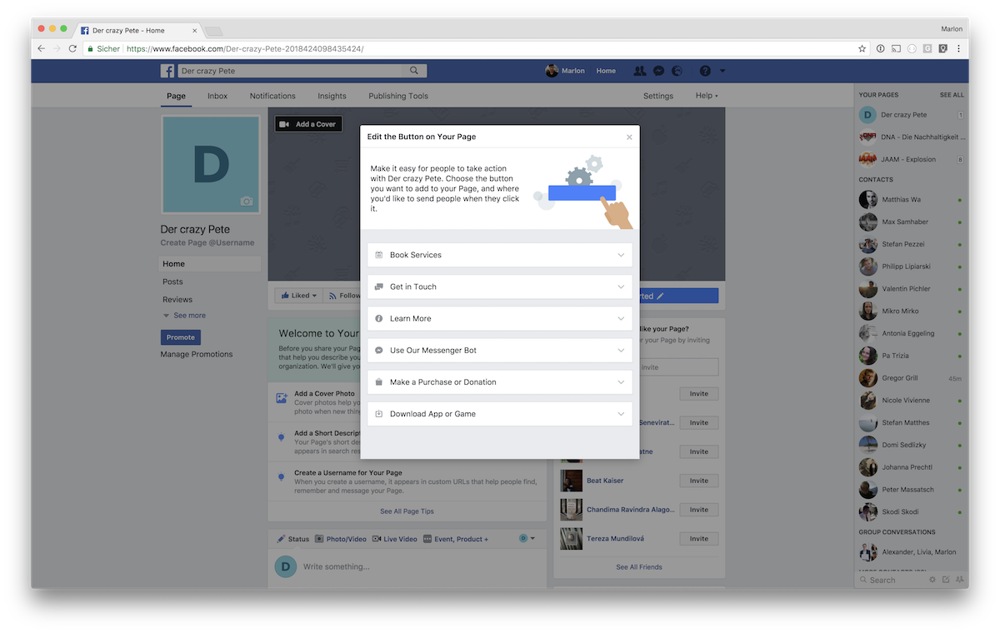

# Bare Metal Facebook Chatbot

This is a very basic chatbot, demonstrating how to create a Facebook chatbot backend without any framework wrapping and hiding all the magic magic.

## Deploy and connect with Facebook

The following steps are required to deplpoy this application as an AWS lambda and to connect it to your Facebook application in order to answer your Facebook page's message requests for you.

### Verify your AWS account has required rights

TODO: link to other docu?

### Create Facebook app

1. Go to [apps at Facebook for developers](https://developers.facebook.com/apps/) and create a new app

2. Add two products to your app: Webhooks and Messenger

### Create Facebook page

Go to [Create a Page](https://www.facebook.com/pages/create) and follow instructions

### Deploy secrets to AWS

Your applications needs three secrets in order to communicate with your community through the Facebook messenger. Once deployed to AWS they will be available in your lambda applications.

> **Verify Token**: Self chosen token, only you know, to verify the request was sent by your application

> **Page Access Token**: Secret token, generated by Facebook, which lets you interact with your page's users

> **App Secret**: Secret to validate Facebook's messages integrity

1. Go to AWS web console
2. Navigate to your API Gateway
3. Click on Stages in the left sidebar
4. Chose your stage
5. Switch to Stage Variables
6. Add the secrets described above
    1. `facebook_verify_token` choose a random string and **keep it**
    2. `facebook_access_token` can be found at the Facebook app's dashboard at Messenger -> Token Generation: https://developers.facebook.com/apps/{fb-app-id}/messenger/
    3. `facebook_app_secret` can be found at your Facebook app's dashboard: https://developers.facebook.com/apps/{fb-app-id}/dashboard/

### Deploy this application as lambda using claudia.js

There are multiple npm scripts defined in this `package.json` to help you deploy and update your chatbot. The scripts pack your local code into a ZIP file, deploy them to AWS lambda and set up the routing using an AWS API Gateway.

1. Make sure your AWS cli is installed set up, if not [install the cli](https://aws.amazon.com/de/cli/) and type `cli configure`
2. Type `npm run deploy`
3. Type `npm run update` if the chatbot is already deployed and you want to update it

### Connect your Facebook app and your chatbot application

1. At your Facebook app's dashboard (https://developers.facebook.com/apps/{fb-app-id}/dashboard/) go to Products -> Messenger -> Token Generation choose the Page you created previously and grant your app the requested rights
2. **Keep the generated Page Access Token**
3. Go to Products -> Messenger -> Webhooks click on `Setup Webhooks`
4. Paste your chatbot's URL, the Verify Token you have chosen before and chose messeges 

5. Click on `Verify and Save`
6. Also at Webhooks click on `Select a Page`, choose the page created previously and click on `Subscribe`

## Test and debug

1. Go to your Facebook page and start chatting by `Edit the Botton on Your Page`, choose `Use our Messenger Bot`, then hover the botton and click on `Test Button`

2. Be happy to see everything works as expected
3. If you want to see your application's logs, go to your AWS web console and navigate to CloudWatch -> Logs -> *your application* and see logs