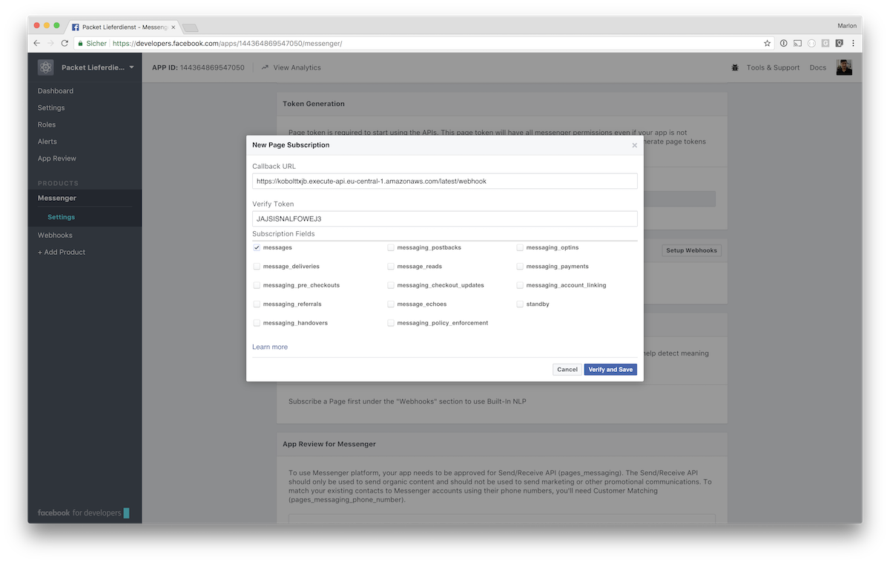
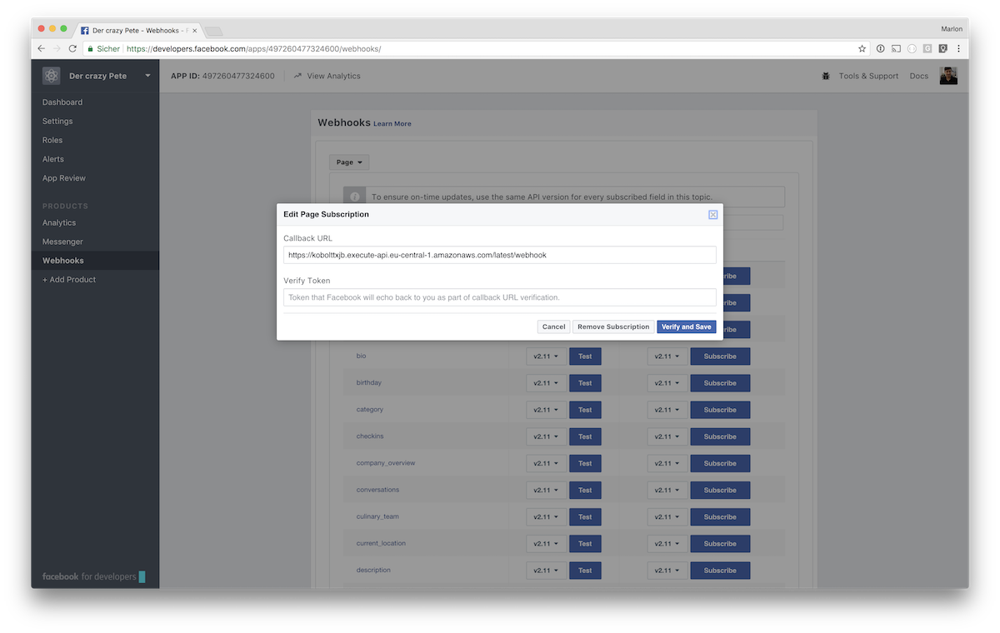

# Bare Metal Facebook Chatbot

This document describes how to deploy, use and debug the [bare matal chatbot](../bare-metal_bot).

## Content

- [Prerequisites](#prerequisites)
- [Deploy and connect with Facebook](#deploy-and-connect-with-facebook)
- [Test and debug](#test-and-debug)
- [Application details](#application-details)
  - [Request flow](#request-flow)
  - [Token verification](#token-verification)
  - [Message signature validiation](#message-signature-validiation)

## Prerequisites

- Facebook Account
- Facebook Developer Account
- [Setup Facebook Page and App](../setup_facebook)
- Node.js
- Claudia.js
- AWS Account
  - Permission "Lambda function"
  - Permission "API Gateway endpoints"
  - Permission "IAM Roles"

## Deploy and connect with Facebook

The following steps are required to deplpoy this application as an AWS lambda and to connect it to your Facebook application in order to answer your Facebook page's message requests for you.

### Deploy environment variables to AWS

Your applications needs three environment variables in order to communicate with your community through the Facebook messenger. Once deployed to AWS they will be available in your lambda applications.

> **Verify Token**: Self chosen token, only you know, to verify the request was sent by your application

> **Page Access Token**: Secret token, generated by Facebook, which lets you interact with your page's users

> **App Secret**: Secret to validate Facebook's messages integrity

1. Go to AWS web console
2. Navigate to your API Gateway
3. Click on Stages in the left sidebar
4. Chose your stage
5. Switch to Stage Variables
6. Add the environment variables described above
    1. `facebook_verify_token` choose a random string and **keep it**
    2. `facebook_access_token` can be found at the Facebook app's dashboard at Messenger -> Token Generation: https://developers.facebook.com/apps/{fb-app-id}/messenger/
    3. `facebook_app_secret` can be found at your Facebook app's dashboard: https://developers.facebook.com/apps/{fb-app-id}/dashboard/

### Deploy this application as lambda using claudia.js

There are multiple npm scripts defined in this `package.json` to help you deploy and update your chatbot. The scripts pack your local code into a ZIP file, deploy them to AWS lambda and set up the routing using an AWS API Gateway.

1. Make sure your AWS cli is installed set up, if not [install the cli](https://aws.amazon.com/de/cli/) and type `cli configure`
2. Type `npm run deploy`
3. Type `npm run update` if the chatbot is already deployed and you want to update it

### Connect your Facebook app and your chatbot application

1. At your Facebook app's dashboard (https://developers.facebook.com/apps/{fb-app-id}/dashboard/) go to Products -> Messenger -> Token Generation choose the page you created previously and grant your app the requested rights
2. **Keep the generated Page Access Token**
3. Go to Products -> Messenger -> Webhooks click on `Setup Webhooks`
4. Paste your chatbot's URL, the Verify Token you have chosen before and choose messages 

5. Click on `Verify and Save`
6. Also at Webhooks click on `Select a Page`, choose the page created previously and click on `Subscribe`

## Test and debug

1. Go to your Facebook page and start chatting by `Edit the Botton on Your Page`, choose `Use our Messenger Bot`, then hover the botton and click on `Test Button`


2. Be happy to see everything works as expected
3. If you want to see your application's logs, go to your AWS web console and navigate to CloudWatch -> Logs -> *your application* and see logs

## Application details

### Request flow

### Token verification

In order to ensure not anybody can use your webhook, Facebook asks your for a verify token, when registering a new webhook. You need to take care of the verification of this token by your own.
When registering a new webhook, Facebook makes a GET call to your endpoint, passing the verify token provided by the user.

```javascript
/**
 * This function get's called on the default endpoint's GET call, when the chatbot framework gets connected to Facebook via it's developer console initially
 * It verifies that the send verify token matches the given verify token
 * @param {Object} req aws lambda request object
 * @returns {Number|null} Returns a the request's hub challenge as Number or null, if the passed verify token does not match
 */
const initialFacebookConnectionHandler = req => {
    console.log('running initialFacebookConnectionHandler')

    if(objectPath.get(req, ['queryString', 'hub.verify_token']) === objectPath.get(req, 'env.facebook_verify_token')) {
        console.log('Passed validiation')
        return parseInt(req.queryString['hub.challenge'])
    }

    console.log('Did not passed validiation')
    return new api.ApiResponse('Did not passed validiation', {'Content-Type': 'text/plain'}, 400)
}
```

`req.env.facebook_verify_token` is available once you added the token as AWS API Gateway stage environment variable, as [descibed above](#deploy-environment-variables-to-aws). Make sure to pass the prioviously created validiation token, when adding webhooks. Facebook will add the verify token as query parameter `hub.verify_token`.
Return the challenge Facebook also provides as query parameter, if validiation passed.



### Message signature validiation

To make sure each call is made by your application and not modified by anybody else Facebook provides a hash of the message body created with your app secret. Make sure to check the messages integrity!

```javascript
/**
 * Calculates hash by given algorithm and compares calculated by given signature
 * @param {String} signatureHeader Header as sent by Facebook containing hashing algorithm and hash, something like "sha1=alskjfaösekjf"
 * @param {*} secret Facebook app secret
 * @param {*} rawBody Request body to calculate hash
 */
const _checkMessageIntegrity = (signatureHeader, secret, rawBody) => {
    const [algorithm, givenSignature] = signatureHeader.split('=')
    const calculatedSignature = crypto.createHmac(algorithm, secret).update(rawBody).digest('hex')
    // Compare strings with tsscmp to prevent timing attacks: https://codahale.com/a-lesson-in-timing-attacks/
    return tsscmp(calculatedSignature, givenSignature)
}
```
