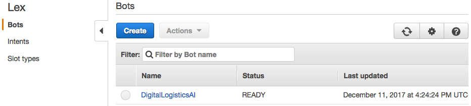
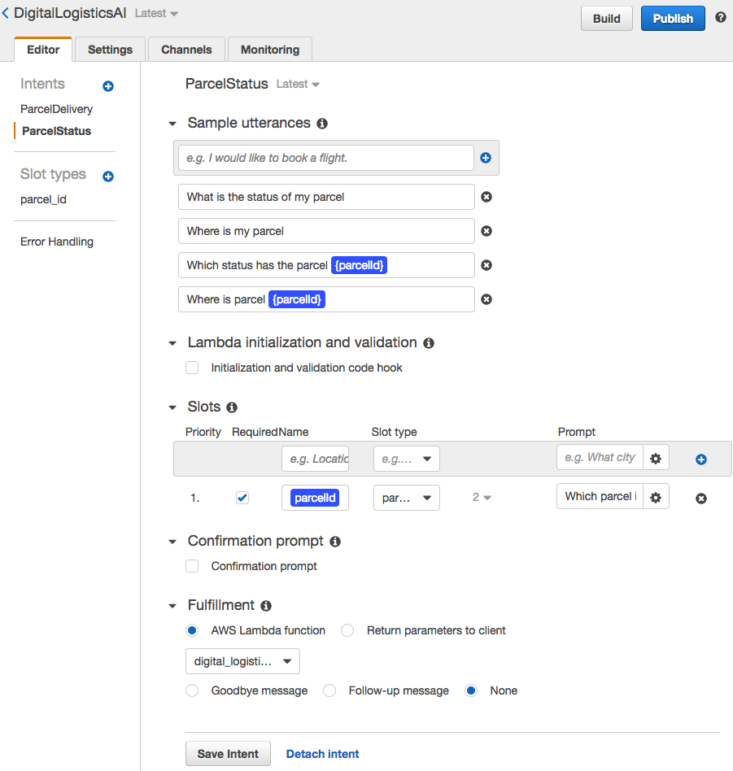
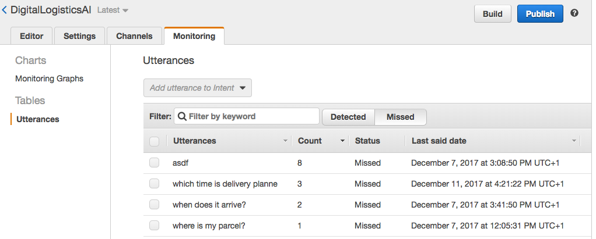
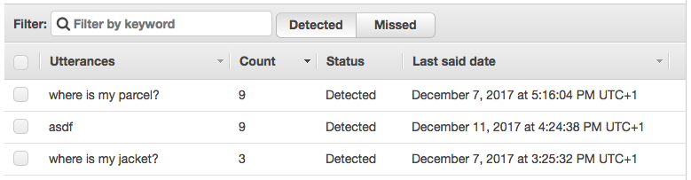

# AWS Lex

## Concepts

Lex provides three elements on global level. These are the bots, intents and slot types. A bot has several intents and slot types. The intents define an action the user want to archive. They may contain some slots. Each slot is of a specific slot type. An intent or slot type once defined for some bot is available for every other bot. 

The screenshot below shows how to configure a bot. Each intent is described by 'sample utterances'. These are user messages that match the intent. Some messages contain a blue colored word. These are slots that may or must be provided by the user and match a specific slot type. If a slot is marked as required and not given by the user, the bot will automatically response with a clarifying prompt.

### Bots

_tbd_

### Intents

_tbd_

### Slot Types

_tbd_

### Lambda Function Callbacks

For input validation and after intent fulfillment the bot can be configured to call a lambda function. The initialization and validation function is called after each message from the user matching the intent. The fulfillment function is only called after all required slot values are resolved (either by direct user input or after clarifying prompts).

### Channels

A channel is an integration into some messenger platform. Lex supports integration for Facebook, Kik, Slack and Twilio SMS. Of course Alexa is supported as well. However, in this case the bot must be exported as an Alexa Skill Set (every time again when the bot is changed).

### Intent Improvement

To improve intent matching lex provides a log of all user messages. The list can be filtered to just show missed utterances. Using this view it is possible to directly add a missed utterance to an existing intent. This allows an improvement of the bot, based on actual user requests instead of just prior knowledge of possible messages. Also, the log shows that the utterance 'where is my jacket?' matched some intent. We know it matched the intent 'ParcelStatus'. However, we have no idea to avoid this match. Basically, every text like 'where is my xyz?' will match that intent.

After adding a missed utterance to an intent, it is detected after next bot recreation. Sadly, the log does not show which intent the message matched. So for example, it is not visible, that the text 'asdf' was matched to the response from the clarifying prompt asking for a parcel id.

## Evaluation

There are three main reasons why we did not take Lex in account further:

* Supports only English language at the moment
* No out-of-the-box conversation state
* About 30 seconds wait time to build the bot (necessary after each change to the bot configuration)
