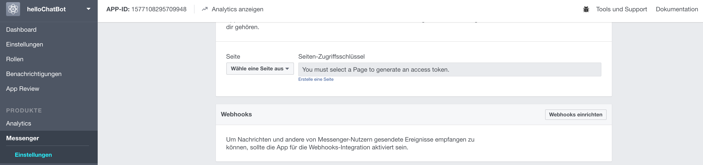
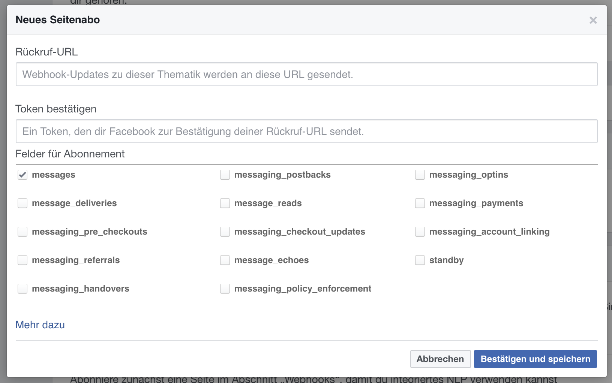
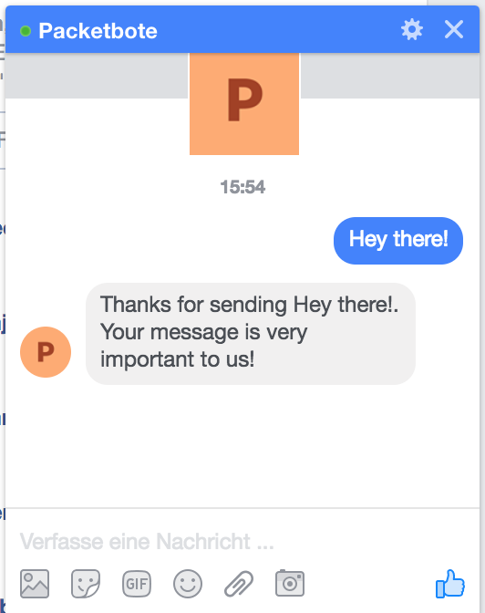

# POC 1 - Facebook Chatbot using Claudia.js in 5 Minutes

## Prerequisites
* Facebook Account
* Facebook Developer Account
* [Setup Facebook Page and App](../setup_facebook)

* Node.js
* Claudia.js

* AWS Account
  * Permission "Lambda function"
  * Permission "API Gateway endpoints
  * Permission "IAM Roles"

## Hello World Bot
The Step-by-Step instructions is loosely based on the linked tutorial: https://claudiajs.com/tutorials/hello-world-chatbot.html

## Step-by-Step Instructions

### Implement the Bot

It is time to implement the bot. We start simple:

`$ npm init`

And continue to add some dependency:

`$ npm install claudia-bot-builder -S`

And finally add some code:

```javascript
// bot.js
var botBuilder = require('claudia-bot-builder');
module.exports = botBuilder(function (request) {
	return 'Thank for sending ' + request.text + '. Your message is very important to us!'
}, {platforms: ['facebook']}
```

### Set up AWS infrastructure
`$ claudia create --region eu-central-1 --api-module bot`

Using this command the AWS infrastructure is set up. We must make sure that the api-module parameter matches our javascript filename. Additionally, ClaudiaJS creates a file called claudia.js with the following content (example).
```json
{
  "lambda": {
    "role": "hello-facebook-executor",
    "name": "hello-facebook",
    "region": "eu-central-1"
  },
  "api": {
    "id": "p2y7a0ug38",
    "module": "bot"
  }
}
```

### Configure the Bot
`$ claudia update --configure-fb-bot`

This command updates the infrastructure and lambda (if needed). Additionally, it stores the Access Token and App Secret for further communication. Both must be provided to this command when asked for. In return, it shows the Callback-URL und Verification Token required in the next step.

### Create a Webhook
Now, we need to link the app to AWS and to the page. Therefore, we add a Webhook where incoming messages are forwarded to.



A click on  "Webhooks einrichten" opens a popup to define the Callback-URL and the Verification Token for the Webhook. Both are obtained from the previous step.



Finally, we must define a page from which the app should receive notifications. We choose the one created earlier.


### Test the Bot

As owner/administrator of the page hover over the button "Nachricht senden". A popup appears where you need to click on "Button testen". *When you are not the owner/administrator you can directly click on the button. However, as long as the app is in development mode you need to have the role developer or tester assigned so that the bot will answer.*


After sending an arbitrary message, the bot responds instantaneously.

