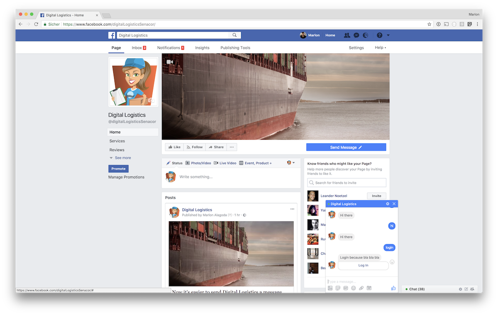
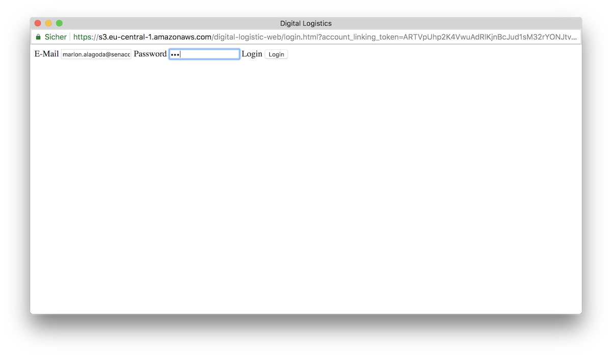
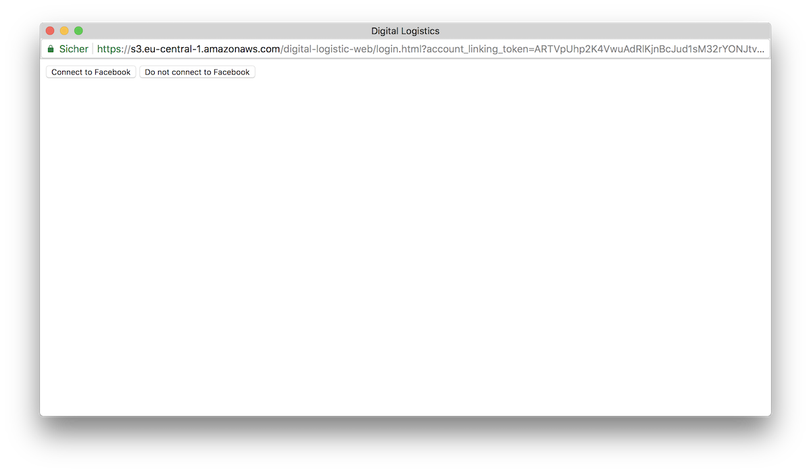
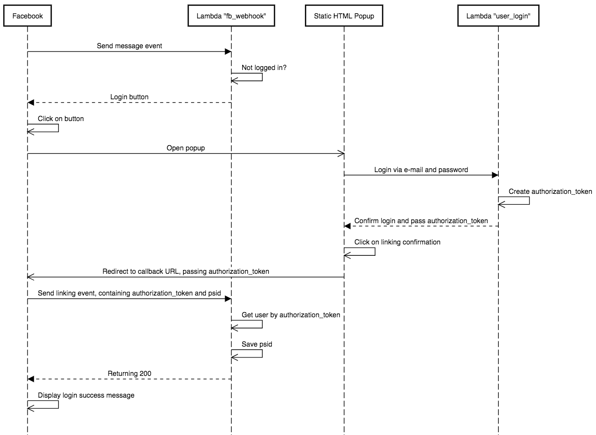

# POC 2 - Facebook Chatbot mit Login und Push Notifications

We recommend to read [POC 1 - Facebook Chatbot using Claudia.js in 5 Minutes](./../facebook_chatbot_with_claudia_js_in_five_minutes) before this, except you are specifically interested in Facebook account (un-)linking and invoking Facebook actions by DynamoDb changes, not caring about chatbots in general.

[This Chatbot](./../digital_logistics_02) extends the [POC 1 Chatbot](./../facebook_chatbot_with_claudia_js_in_five_minutes) ([Code](./../digital_logistics_01)) with the ability to link your Facebook account to our fake company's "Digital Logistics" account by logging in and out and pushing parcel status update notifications to the Facebook messenger on DynamoDb changes.

In addition to all the tools like Claudia.js, Lambdas, Node.js, API Gateways, etc. we already used previously, we used AWS's DynamoDb for triggering parcel change events and storing user data in this iteration. If your are interested in the challenges we solved [have a look here](./../dynamoDb).

## Account linking

Sometimes you need to verify the customer you are talking with via Facebook is exactly the same a certain customer in your company's database is. This can be important if you are sending personal information or allowing the customer to start a buying processes via Facebook.
Facebook provides [workflows for account (un-)linking](https://developers.facebook.com/docs/messenger-platform/identity/account-linking). We followed the [proposed process](https://developers.facebook.com/docs/messenger-platform/identity/account-linking#linking_process):

1. Register a callback URL using Log In Button.

2. Messenger Platform invokes the registered URL when a user starts the account linking flow. The redirect_uri and account_linking_token parameters are appended to your registered callback.

3. Once linking is complete, redirect users to the location provided by redirect_uri and append a authorization_code parameter (defined by you) to confirm linking.

### Process flow

In our architecture two AWS lambdas, Facebook and a static HTML page for the Digital Logistics login are needed to implement the process above. What we did in greater detail:

1. User sends message, triggering the `fb_webhook` lambda to send a login button
2. User clicks on the login button, which opens our static HTML page for the Digital Logistics login in a Popup, passing an `account_linking_token` and a `redirect_url`
3. User uses e-mail and password for the Digital Logistics login
4. `user_login` lambda gets called by the static HTML page, confirms that the e-mail and password matches, creates a random `authorization_token`, saves and returns it to the static HTML page
5. User confirms Facebook connection, Popup calls redirect URL attaching the `authorization_token`, to notify Facebook about the successful login and Facebook closes popup
6. Facebook calls the `fb_webhook` again passing the previously created `authorization_token` and the page scoped user id "`psid`"
7. `fb_webhook` gets user by `authorization_token` from database, saves the `psid` and returns 200
8. Facebook prints login success message to chat

## Account unlinking

It might be necessary to unlink a company account and a Facebook messenger account, for example if the user does not want the company to store his/her facebook `psid` for contacting anymore. The unlinking process is even easier then the linking process.

### Process flow

1. User sends message, triggering the `fb_webhook` lambda to send a logout button
2. User clicks on the logout button
3. Facebook opens info modal asking the user if he/she wants to proceed
4. If user agrees, Facebook calls `fb_webhook` lambda with an unlink event containing the user's `psid`
5. `fb_webhook` lambda deletes user's `psid` from database and returns 200
6. Facebook show logout success message

## Pushing notifications

TODO
