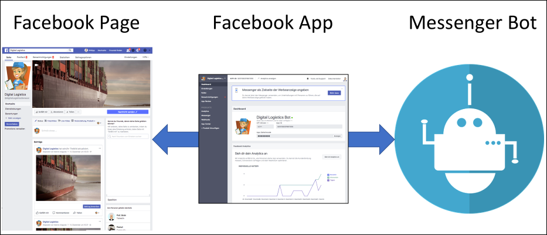

# Facebook Pages, Apps and Bot

## Pages

A page is the must have for a business to be present on Facebook. It allows posting news and receive messages from users. Also, when users click the "like" button they get the page's updates on their news stream.

## Apps

An app adds some extra functionality to Facebook. Not only, this is limited to enhancements of a page, but also an app can run standalone.

What an app is actually used for is defined by its products. Facebook offers a wide range of products like "App Events", "Webhooks", "Messenger", "Instagram", "Games" and many more. 

Products once assigned to an app cannot be removed anymore. This is designed on purpose by Facebook. However, one can deactivate/configure them such that they are not in use anymore.

### Webhooks and Messenger

*The actual setup for our usecase is described [here](../setup_facebook/).*

The webhooks product can subscribe for events of topics, namely, of pages, users or others. Per topic a callback url is defined on that the events are posted. Each topic contains several events.

The messenger product allows receiving several specific message related events. It is tightly coupled with the webhooks product. Activating the messenger product automatically creates a webhook for the general messages event. Though, the product allows filtering for specific events like "messages" (the sent message), "message_delivery", "message_read", "messaging_postback" etc.

Additionally, the messenger product has integrated support for NLP, namely, for wit.ai. Before the event is pushed to the webhook, it is handled by some wit.ai model. The original event is enriched with the NLP processing result.

Though one can create multiple apps that listen to the same page for message events, only one app will receive those. The other app receives standby events only. Which app is the primary one, is configured in the page settings. However, this can be changed dynamically using the ["Handover Protocol" *(extern)*](https://developers.facebook.com/docs/messenger-platform/handover-protocol).

## Bot

The actual bot is an application which has to provides an HTTP endpoint which is able to understand the Facebook Messenger API. Incomming Facebook messages and events has to be process and will be answered
asynchronously via the Facebook graph API.

*See some further documentation about the bot [here](../fb_chatbot_basics/README.md)*
