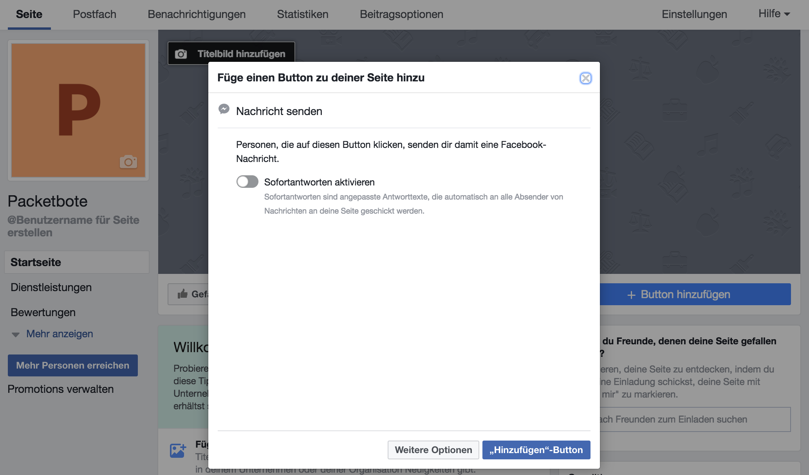
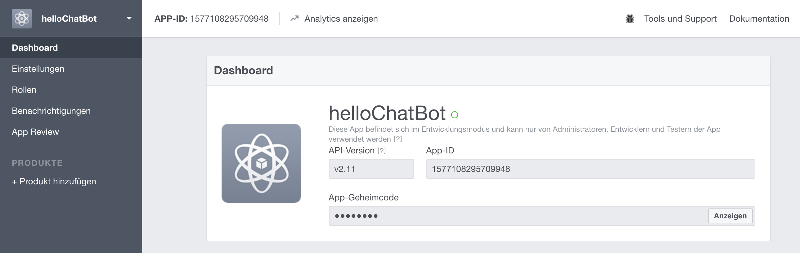
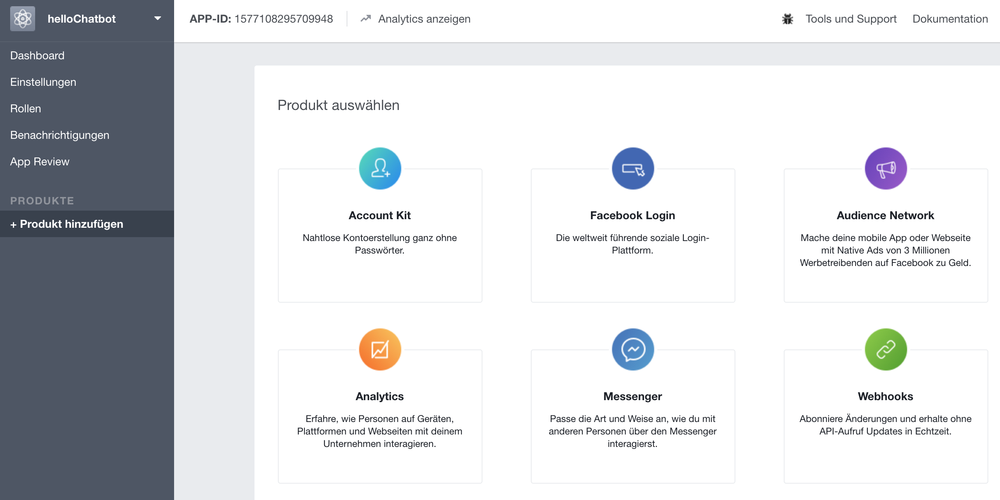

# Setup Facebook Page and App

## Step-by-Step Instructions

### Create a Facebook Page
First, we need to create a new Facebook Page. Later we will integrate the bot on that page.

https://www.facebook.com/pages/create/

We chose some appropriate page category, fill in some required fields and the page is already setup.
By default, it is not possible to send any message to the new created page. To add this functionality click on the button "Button hinzufügen". Following click on "Hinzufügen"-Button. The page is now set up for our purposes.

### Create a Facebook App
Next, create a Facebook App which will be integrated in the previously create page.
https://developers.facebook.com/apps/

Now, we need to add the "Message Product". In the menu, click on the link "Produkt hinzufügen". 

Finally, click on "Messenger"->"Einrichten"

