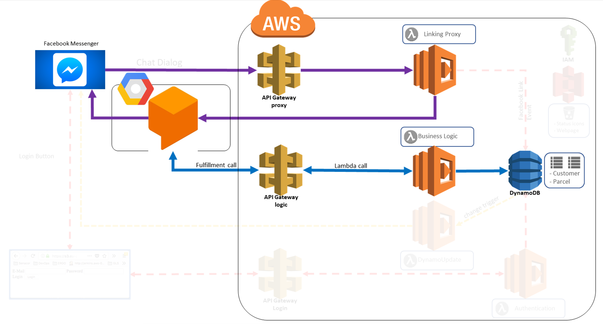
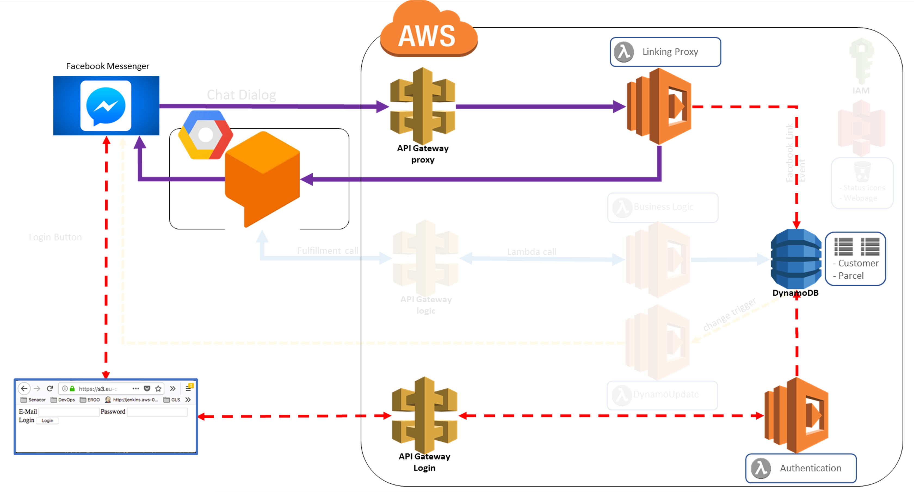
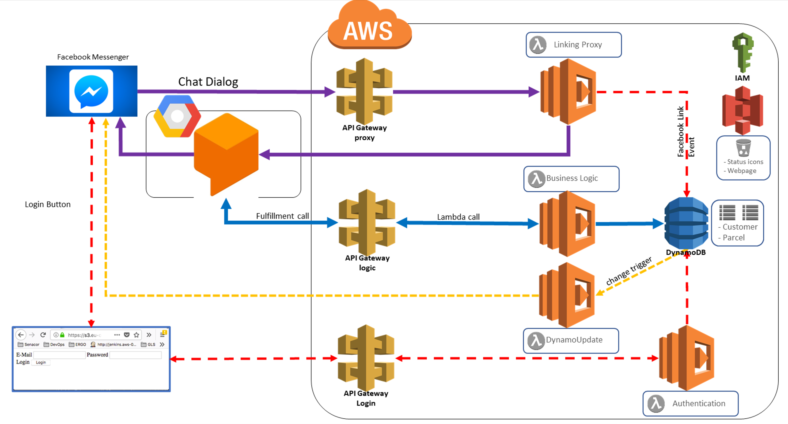

# Target Architecture

In this chapter we describe our overall target architecture. Since the architecture is quite complex, we will have a look on it in three scenarios. So, in each scenario we see some part of the architecture. However, the scenarios technically overlap.

## Infrastructure setup

Our infrastructure setup embraces three global players in the IT software sector: Facebook, Amazon, Google.

### Facebook

We use the Facebook Messenger as the endpoint to our bot. This is where the users communicate with our Digital Logistics chat bot. We have one page that has an app attached which handles the messaging. Incoming messages are routed through the app to one of our many lambdas in AWS via an API Gateway. 

### Amazon Web Services

In AWS we have set up a DynamoDB instance with two tables, namely, `digital_logistics_customer` and `digital_logistics_parcel`. The first table stores customer information and possible data about a linked Facebook account. The other table holds the parcel information and references exactly one customer.

Additionally, we have set up four lambdas. Three of them are exposed via separate API Gateways. The first one acts as a proxy and webhook for the Facebook messenger. The second one executes the business logic related to incoming messages. The third one deals with authentication. And the last one is called only from within AWS for parcel update notifications. Therefore, we do not need to expose it.

In a public S3 bucket we store static content like images referenced in a parcel status. Additionally, we provide a simple HTML login page for the account linking scenario.

At last, we use IAM to control permissions.

### Google Dialogflow

In Dialogflow we build up our conversation. It analyzes incoming messages and calls a lambda function to execute the business logic. Additionally, it calls Facebook's Graph API to return the bot's message.

## Scenario 1: Message Handling

*TBD*

## Scenario 2: Account Linking

*TBD*

## Scenario 3: Push Notification

This scenario builds up on top of the account linking scenario. Once the facebook account is linked with the business account, we can send push notifications to the user. That means, every time the status of one of the user's parcel changes we send a Facebook message with the current status to the user.

It is the simplest scenario and involves only the DynamoDB and one Lambda which directly calls Facebook's Graph API. The lambda is invoked by a trigger from DynamoDB. It extracts the parcel id from the trigger's payload and searches the database for the corresponding user. If the user has its Facebook account linked, the lambda sends a message to that user via Facebook GraphAPI. If the account is not linked, the update information is simply discarded.

## Complete Architecture

As we can see in the complete overview, the main components resided in AWS. There is quite some complex communication between each component. We already left out the relation to S3, since this would make the diagram even harder to read. Nor, would it really improve the understanding of the architecture. IAM is basically involved everywhere to manage access rights for each component.

